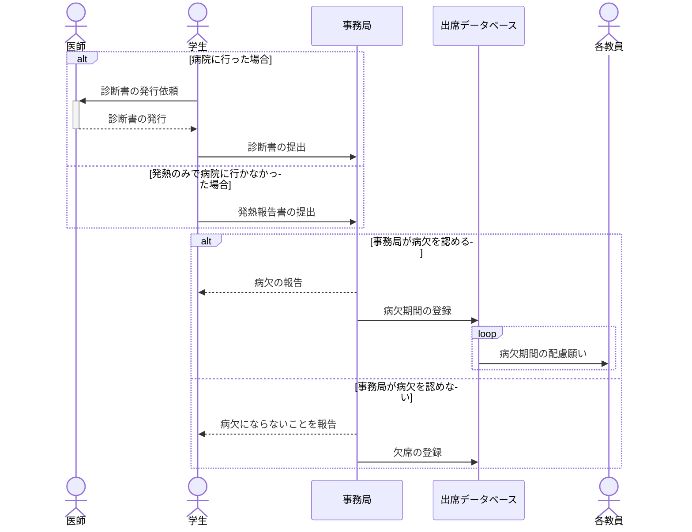

```mermaid
sequenceDiagram
actor i as 医師
actor s as 学生
participant j as 事務局
participant d as 出席データベース
actor t as 各教員


alt 病院に行った場合
s ->>+ i : 診断書の発行依頼
i -->>- s : 診断書の発行
s ->> j : 診断書の提出
else 発熱のみで病院に行かなかった場合
s ->> j : 発熱報告書の提出
end
alt 事務局が病欠を認める
j -->> s : 病欠の報告
j ->> d : 病欠期間の登録
loop 
d ->> t : 病欠期間の配慮願い
end
else 事務局が病欠を認めない
j -->> s : 病欠にならないことを報告
j ->> d : 欠席の登録
end
```
