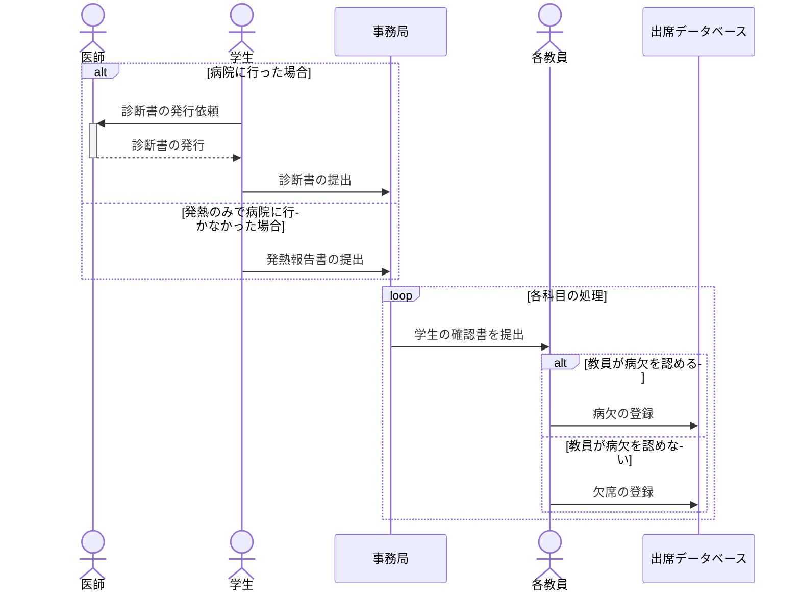

```mermaid
sequenceDiagram
actor i as 医師
actor s as 学生
participant j as 事務局
actor t as 各教員
participant d as 出席データベース

alt 病院に行った場合
s ->>+ i : 診断書の発行依頼
i -->>- s : 診断書の発行
s ->> j : 診断書の提出
else 発熱のみで病院に行かなかった場合
s ->> j : 発熱報告書の提出
end
loop 各科目の処理
j ->> t : 学生の確認書を提出
alt 教員が病欠を認める
t ->> d : 病欠の登録
else 教員が病欠を認めない
t ->> d : 欠席の登録
end
end
```
