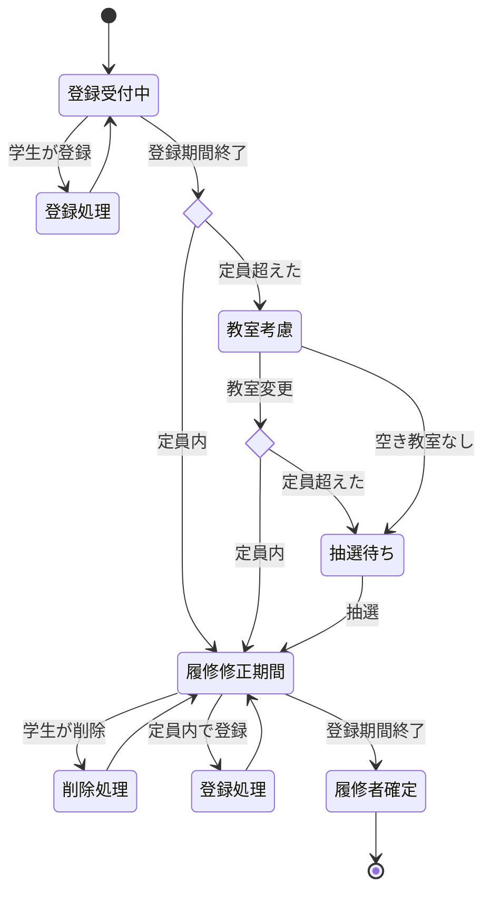

```mermaid
stateDiagram-v2
direction TB
s1 : 登録受付中
s2 : 登録処理
s4 : 抽選待ち
s8 : 教室考慮
s5 : 履修修正期間
s6 : 削除処理
s7 : 登録処理
s3 : 履修者確定

state c <<choice>>
state b <<choice>>

[*] --> s1
s1 --> s2 : 学生が登録
s2 --> s1
s1 --> c : 登録期間終了
c --> s5 : 定員内
c --> s8 : 定員超えた

s8 --> b : 教室変更
b --> s5 : 定員内
b --> s4 : 定員超えた
s8 --> s4 : 空き教室なし
s4 --> s5 : 抽選
s5 --> s6 : 学生が削除
s6 --> s5 : 
s5 --> s3 : 登録期間終了
s5 --> s7 : 定員内で登録
s7 --> s5
s3 --> [*]
```
