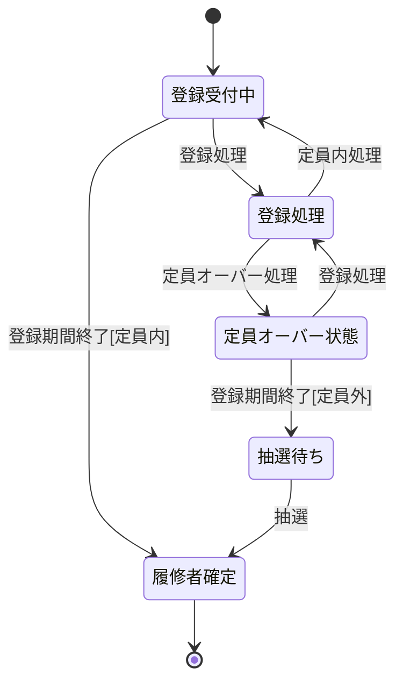

```mermaid
stateDiagram-v2
direction TB
s1 : 登録受付中
s2 : 登録処理
s3 : 履修者確定
s4 : 抽選待ち
s5 : 定員オーバー状態

[*] --> s1
s1 --> s2 : 登録処理
s2 --> s1 : 定員内処理
s2 --> s5 : 定員オーバー処理
s5 --> s2 : 登録処理
s5 --> s4 : 登録期間終了[定員外]
s1 --> s3 : 登録期間終了[定員内]
s4 --> s3 : 抽選
s3 --> [*]
```
