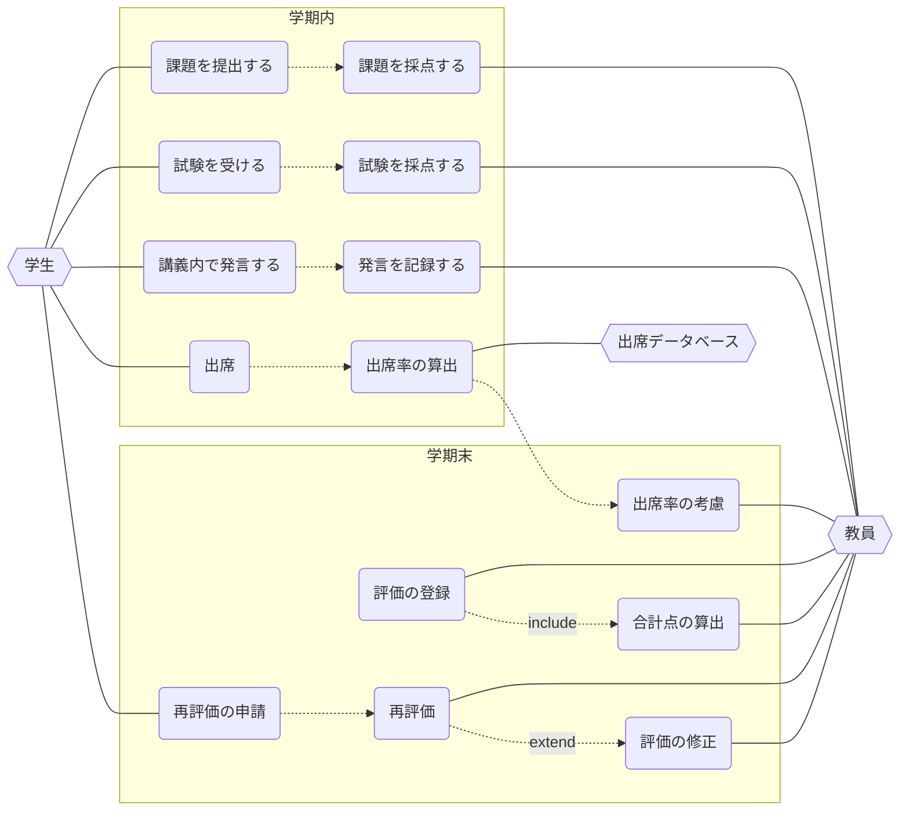

```mermaid
flowchart LR
a1{{学生}}
a3{{出席データベース}}
a2{{教員}}

a1 --- g1(課題を提出する)
a1 --- g2(試験を受ける)
a1 --- g3(講義内で発言する)
a1 --- g5(出席)
a1 --- g4(再評価の申請)

d1(出席率の算出) --- a3

t1(課題を採点する) --- a2
t2(試験を採点する) --- a2
t3(発言を記録する) --- a2
t9(出席率の考慮) --- a2
t5(合計点の算出) --- a2
t7(評価の登録) --- a2
t6(再評価) --- a2
t8(評価の修正) --- a2

g1 -.-> t1
g2 -.-> t2
g3 -.-> t3
d1 -.-> t9
g5 -.-> d1
t7 -.include.-> t5
t6 -.extend.-> t8
g4 -.-> t6

subgraph 学期内
g1
g2
g3
g5
t1
t2
t3
d1
end

subgraph 学期末
g4
t5
t6
t7
t8
t9
end
```
