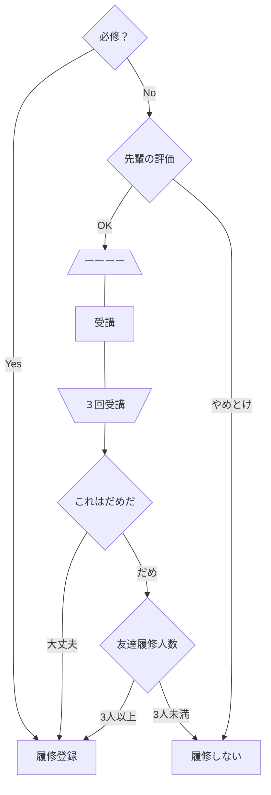

```mermaid
flowchart TD
hisshu{"必修？"}
senpai{"先輩の評価"}
loop[/"ーーーー"\]
loopend[\"３回受講"/]
dameda{"これはだめだ"}
ukeru["受講"]
tomodati{"友達履修人数"}
rishu["履修登録"]
pass["履修しない"]

hisshu -->|Yes| rishu

hisshu -->|No| senpai -->|OK| loop --- ukeru 
--- loopend --> dameda -->|大丈夫| rishu
dameda -->|だめ| tomodati -->|3人以上| rishu
senpai -->|やめとけ| pass
tomodati -->|3人未満| pass

```
