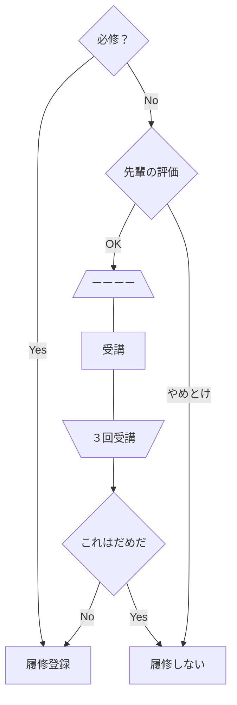

```mermaid
flowchart TD
hisshu{"必修？"}
senpai{"先輩の評価"}
loop[/"ーーーー"\]
loopend[\"３回受講"/]
dameda{"これはだめだ"}
ukeru["受講"]
rishu["履修登録"]
pass["履修しない"]

hisshu -->|Yes| rishu
hisshu -->|No| senpai -->|OK| loop --- ukeru 
--- loopend --> dameda -->|Yes| pass
senpai -->|やめとけ| pass
dameda -->|No| rishu

```
