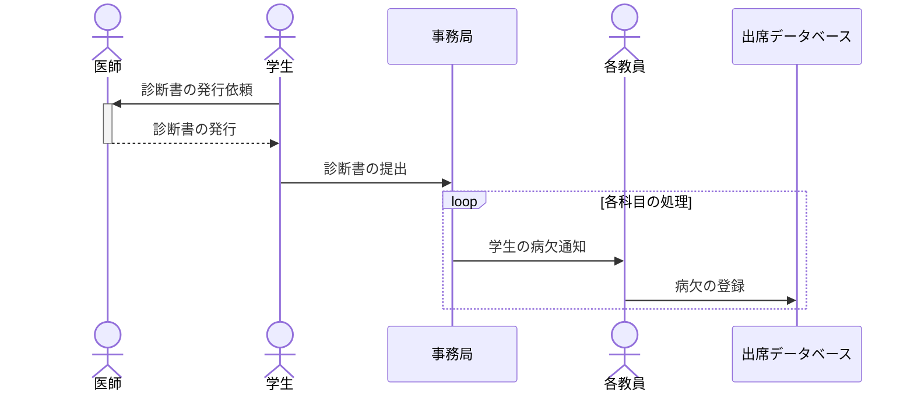

```mermaid
sequenceDiagram
actor i as 医師
actor s as 学生
participant j as 事務局
actor t as 各教員
participant d as 出席データベース

s ->>+ i : 診断書の発行依頼
i -->>- s : 診断書の発行
s ->> j : 診断書の提出
loop 各科目の処理
j ->> t : 学生の病欠通知
t ->> d : 病欠の登録
end
```
