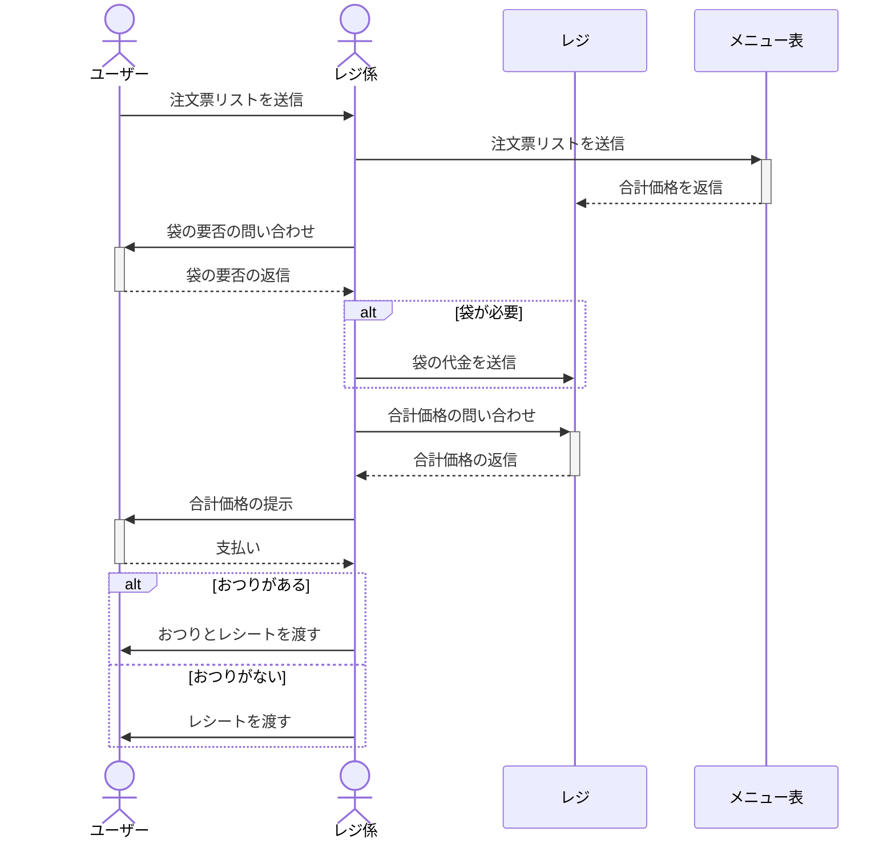

```mermaid
sequenceDiagram
actor y as ユーザー
actor r as レジ係
participant l as レジ
participant m as メニュー表
y ->> r : 注文票リストを送信
r ->>+ m : 注文票リストを送信
m -->>- l : 合計価格を返信
r ->>+ y : 袋の要否の問い合わせ
y -->>- r : 袋の要否の返信
alt 袋が必要
    r ->> l : 袋の代金を送信
end
r ->>+ l : 合計価格の問い合わせ
l -->>- r : 合計価格の返信
r ->>+ y : 合計価格の提示
y -->>- r : 支払い
alt おつりがある
    r ->> y : おつりとレシートを渡す
else おつりがない
    r ->> y : レシートを渡す
end

```
