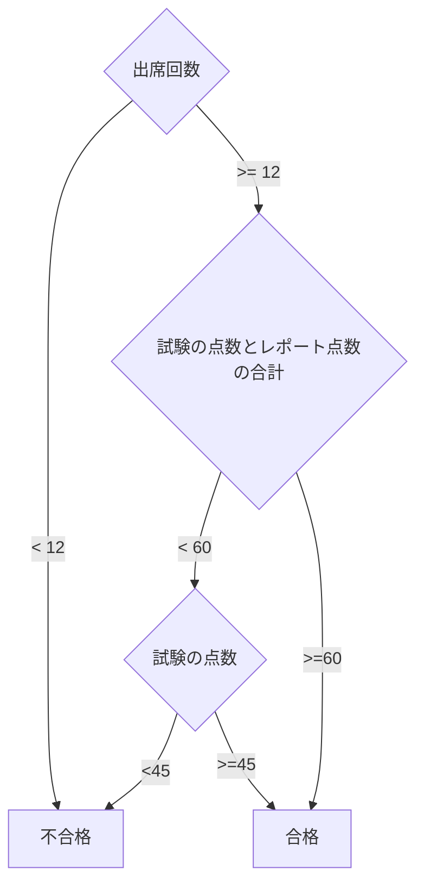

```mermaid
flowchart TD
attend{出席回数}
report{試験の点数とレポート点数の合計}
exam{試験の点数}
pass[合格]
fail[不合格]
attend -->|< 12| fail
attend -->|>= 12| report
report -->|< 60| exam
exam -->|<45| fail
exam -->|>=45| pass
report -->|>=60| pass

```
