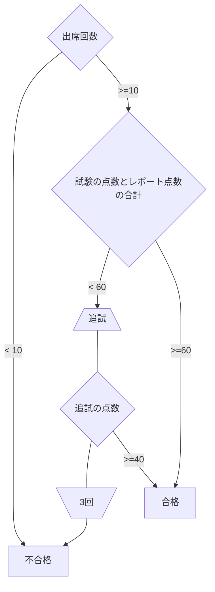

```mermaid
flowchart TD
attend{出席回数}
report{試験の点数とレポート点数の合計}
loop[/"追試"\]
exam{追試の点数}
loopend[\"3回"/]
loop --- exam --- loopend
pass[合格]
fail[不合格]
attend -->|< 10| fail
loopend --> fail
attend -->|>=10| report
report -->|< 60| loop
exam -->|>=40| pass
report -->|>=60| pass

```
