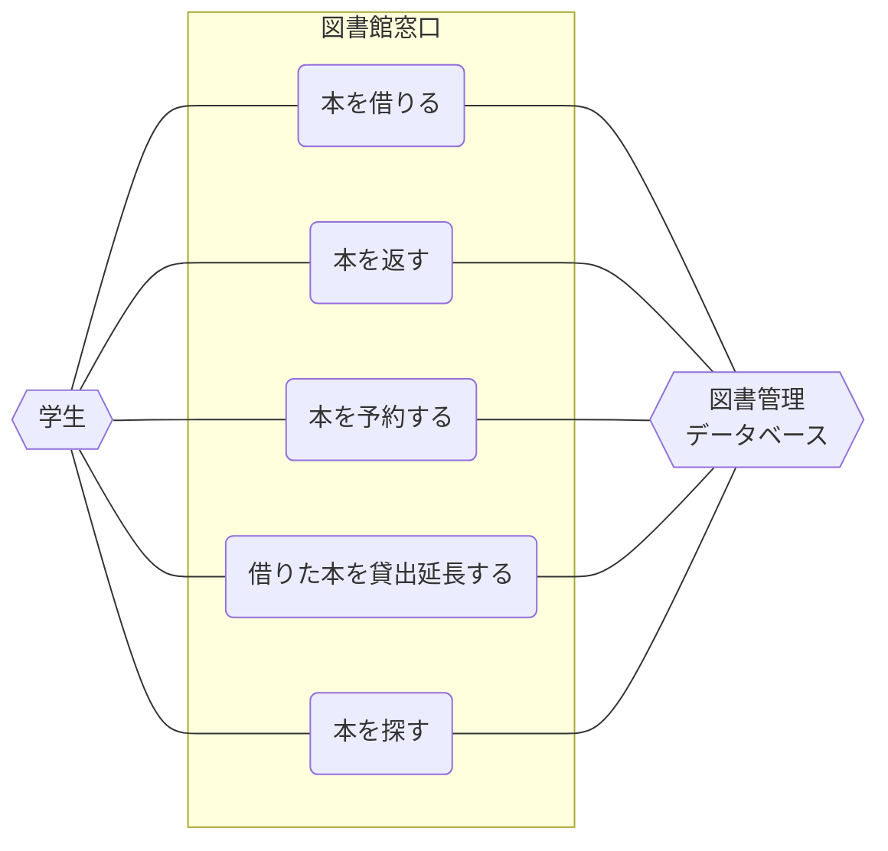

```mermaid
flowchart LR
a1{{学生}}
a2{{図書管理</br>データベース}}
a1 --- u1(本を借りる)
a1 --- u2(本を返す)
a1 --- u3(本を予約する)
a1 --- u4(借りた本を貸出延長する)
a1 --- u5(本を探す)
u1 --- a2
u2 --- a2
u3 --- a2
u4 --- a2
u5 --- a2

subgraph 図書館窓口
u1
u2
u3
u4
u5
end
```
