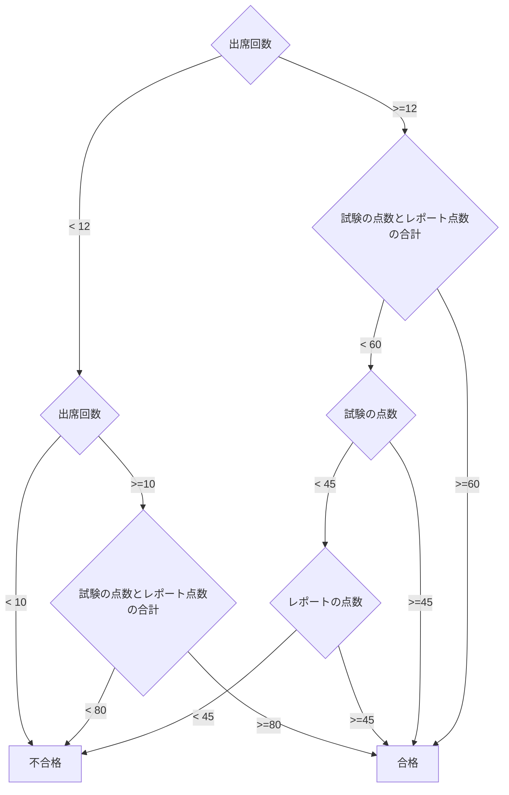

```mermaid
flowchart TD
attend{出席回数}
attend2{出席回数}
report2{試験の点数とレポート点数の合計}
report{試験の点数とレポート点数の合計}
exam{試験の点数}
report3{レポートの点数}
pass[合格]
fail[不合格]
attend -->|< 12| attend2
attend2 -->|< 10| fail
attend2 -->|>=10| report2
report2 -->|>=80| pass
report2 -->|< 80| fail
attend -->|>=12| report
report -->|< 60| exam
exam -->|< 45| report3
report3 -->|< 45| fail
report3 -->|>=45| pass
exam -->|>=45| pass
report -->|>=60| pass

```
